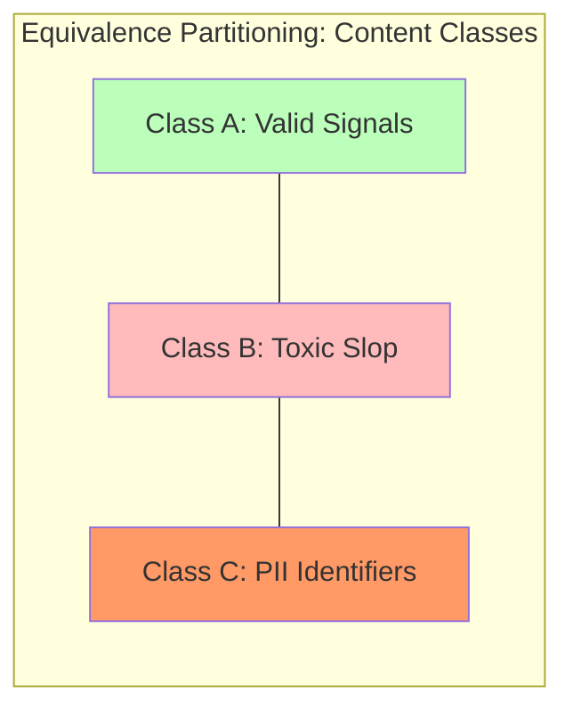

# 🖼️ Component A: CA3 Poster - STT Messenger Safety Case Study

## 🏗️ 1. System Overview
### Application: STT Messenger ()
STT Messenger is a "Sovereign Digital Space" designed as a proactive defense against the "Algorithmic Slop" of modern social media. It prioritizes the protection of **minors and vulnerable populations** through a local-web architecture that ensures content is audited before it ever reaches the network.

**Key Functionalities**:
- **NeuroSymbolic Safety Auditor**: A semantic gate detecting toxicity, sentiment, and PII.
- **Content Sovereignty**: Local "Pseudo-Encryption" (ENC: prefix) of all messages.
- **Identity Isolation**: Multi-user simulation with isolated sender hashes.

---

## 🎯 2. Testing Strategy
We employ a multi-layered strategy to ensure 100% reliability for minor protection.

**Testing Types**:
- **Functional**: Verifying the 12 security gates.
- **Performance**: Auditing API latency (< 100ms) under concurrent signal load.
- **Regression**: Automated Pytest suite runs on every backend deployment.

**Testing Levels**:
- **Unit (Logical)**: Testing individual regex patterns in the `SafetyAuditor`.
- **Integration (API)**: Verifying the handover from Frontend signals to the Backend database.
- **System (E2E)**: Simulating real-world user behaviors using the Secure Lab Dashboard.

---

## 🔬 3. Test Case Design (Methodology)

### 3.1 Black-Box: Behavior Verification
- **Equivalence Partitioning (EP)**: Segmenting content into `Safe`, `Toxic (Slurs)`, and `Sensitive (PII)` classes.
- **Boundary Value Analysis (BVA)**: Validating message length at `[0, 1, 10000, 10001]`.

### 3.2 White-Box: Logic Coverage
- **Control Flow Analysis**: Ensuring 100% path coverage for the `audit()` function logic branches (Toxic -> PII -> Payload -> Command).

---

## 📋 4. Sample Test Cases (12-Point Matrix Extract)

| ID | Technique | Input | Expected Output | Status |
|---|---|---|---|---|
| **TC-01** | EP | "bastard" | `422 Toxic Blocked` | ✅ PASS |
| **TC-02** | EP | "9850593788" | `422 PII Blocked` | ✅ PASS |
| **TC-03** | BVA | Len: 10,001 | `422 Payload Limit` | ✅ PASS |
| **TC-04** | Semantic| "I will kill you"| `422 Hostile Tone` | ✅ PASS |
| **TC-08** | Sanit. | `<script>...` | `422 XSS Detected` | ✅ PASS |
| **TC-12** | Crisis | "suicide" | `422 Crisis Support`| ✅ PASS |

---

## 🛑 5. Defect Analysis & Lifecycle
We utilize a formal **Defect Life Cycle** for stability.

**Example Defect (BUG-007)**:
- **Description**: XSS Bypass via leetspeak symbols.
- **Severity**: Critical.
- **Cycle**: NEW -> ASSIGNED -> RESOLVED -> VERIFIED (via Pytest).

---

## 🛠️ 6. Tools Integration
- **Selenium**: Used for Cross-Browser System Testing of the "Visual Interception" UI.
- **Bugzilla**: Centralized defect tracking for all security-critical vulnerabilities.
- **Pytest**: Industry standard for automated regression testing of the 12-point matrix.
- **Uvicorn**: High-performance ASGI server used for stress-testing local daemon latency.
